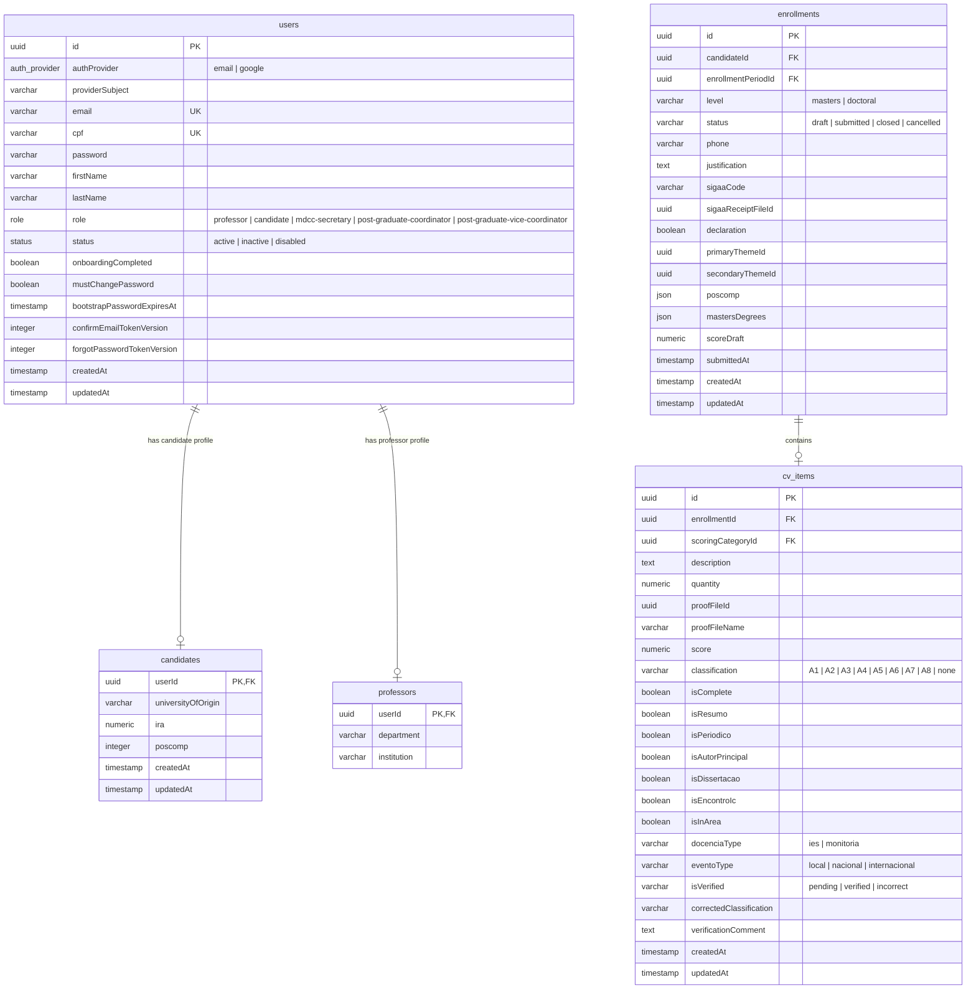
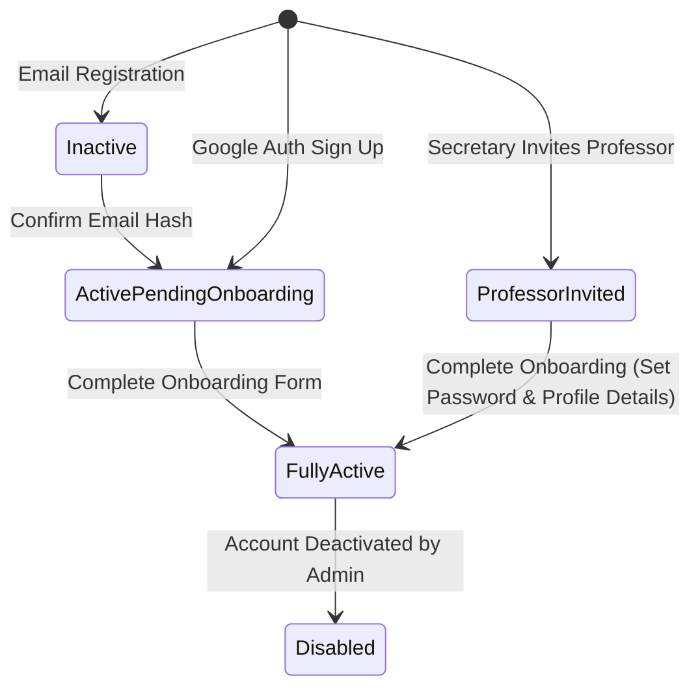

# Anubis Selection System — Project Handoff Documentation

Welcome to the handoff documentation for **Anubis**, the application and selection management system for the **MDCC** (Mestrado e Doutorado em Ciência da Computação) postgraduate program at the **Federal University of Ceará (UFC)**. 

This document serves as a comprehensive overview of the current state of the application, detailing its architecture, database schemas, implemented features, design guidelines, and the roadmap for future development.

---

## 1. Executive Summary

Anubis is designed to automate and streamline the candidate selection workflow for master's and doctoral programs in Computer Science. The system supports multiple user roles, handling everything from user registration, secure email and Google OAuth authentication, role-based access, and session lifecycles, to onboarding workflows and administrative professor/secretary management.

- **Backend Repository:** NestJS 11 + TypeScript + PostgreSQL + Drizzle ORM
- **Frontend Repository:** React 19 + Vite 6 + TypeScript + Tailwind CSS v4 + TanStack Stack (Router, Query, Form)
- **Current Lifecycle State:** Auth and core identity management are fully implemented. Session controls, role-based access levels, and coordinator/secretary/professor inviting mechanisms are complete. Candidate application details (IRA, POSCOMP) and user onboarding are in place. 
- **CV Scoring & Verification (NEW):** The Lattes CV scoring engine and professor verification workflow have been fully implemented. Candidates can fill out a structured CV wizard (with options like Qualis journals, semesters for teaching/projects, and principal authorship), while professors have a dedicated portal to check documents, validate details, and flag incorrect items (which dynamically updates the calculated scores).

---

## 2. System Architecture

The project is split into a backend NestJS application and a separate frontend React application. They communicate via a REST API.

### 2.1 Backend Architecture (NestJS)

The backend follows a **Modular Clean Architecture** pattern structured around domain-specific feature modules rather than generic horizontal layers.

- **Authentication & Sessions:** Uses stateful server-side sessions (`express-session` with `connect-pg-simple` saving sessions to the DB) managed via **Passport**. It utilizes custom guards to enforce session lifecycle constraints (e.g. mandatory password resets, incomplete profile onboarding).
- **Persistence Layer:** Uses **Drizzle ORM** with a Repository pattern (`src/users/infrastructure/persistence/drizzle/`). 
- **Transaction Management:** Handled dynamically via **CLS (Continuation-Local Storage)** context to propagate transaction states across service calls without cluttering service signatures.
- **CV Scoring Engine:** Configured using a centralized [cv-scoring-config.ts](file:///Users/erikbayerlein/Documents/anubis/src/cv-scoring/constants/cv-scoring-config.ts) file. Calculates scores dynamically based on the candidate's level (Mestrado/Doutorado), applying CAPES ratings (A1-A8), quantity multipliers (e.g. semesters), and area research bonuses. Handles float rounding internally.
- **Validation:** Enforced at controller boundaries using `class-validator` and `class-transformer` DTOs.
- **API Documentation:** Automatically generated using **Swagger** with the **Scalar UI** interactive reference available at `/reference` (under API version `/v1`).
- **Transactional Emails:** Handled using **Nodemailer** supporting standard SMTP (for Mailpit local testing) and production transports.

### 2.2 Frontend Architecture (React)

The frontend is built with modern React paradigms, adhering to the **Alexandria Design System**.

- **Routing:** Enforced by **TanStack Router** (file-based routing). No manual editing of the route tree is performed; routing rules are generated statically (e.g. `/manage/enrollments/$id` for CV review).
- **Server State Management:** Handled by **TanStack Query (v5)** to fetch, cache, and synchronize backend resources.
- **Form State and Validation:** Powered by **TanStack Form** with **Zod** schema validations.
- **UI Architecture:** Built with **Radix UI** primitives styled with **Tailwind CSS v4** following the Shadcn component structure.
- **Feature-Based Placement:** Code specific to a business concern is housed under `src/features/<feature_name>/` containing components, hooks, schemas, and API adapters. General tools reside under `src/shared/` or `src/components/`.

---

## 3. Database Schema & Data Models

The PostgreSQL schema is defined using Drizzle ORM in `src/database/schema/`. 



---

## 4. Key Workflows & Auth Security

### 4.1 Authentication Providers & Sign-In Flows

1. **Email/Password Provider:**
   - Normalizes email inputs (`.toLowerCase().trim()`).
   - Uses **bcrypt** with **12 salt rounds** for password hashing.
   - Enforces account activation via confirmation link sent to candidate's email.
2. **Google OAuth 2.0 Provider:**
   - Validates incoming Google ID tokens via the `google-auth-library`.
   - **Provider Conflict Logic:** If a Google login attempt uses an email address already registered under the `email` provider, the system denies authentication and throws a `409 Conflict` (Portuguese: "Use your original provider") to prevent account hijacking or duplicate profiles.
   - New Google users are automatically registered as active candidates with `onboardingCompleted = false` (forcing them into the onboarding sequence).

### 4.2 Out-of-Band Flows (JWT-Based)
JWT tokens are strictly used for out-of-band validation flows, including:
- **Email Confirmation** (Account activation)
- **Password Reset** (Forgot password)
- **Email Change Confirmation** (Modifying email requires confirming the new email first)

To prevent replay attacks or stale links, the system maintains `confirmEmailTokenVersion` and `forgotPasswordTokenVersion` integers on the `users` table. Whenever a password is reset or a verification is completed, the corresponding token version is incremented, immediately invalidating all previously generated links.

### 4.3 Session Lifecycle Restrictions (Guards)
To secure restricted states, the backend implements a two-tier guard model:
1. **`SessionAuthGuard`:** Confirms the presence of an active session cookie (`connect.sid`).
2. **`SessionLifecycleGuard`:** Restricts actions based on temporary state flags:
   - **`mustChangePassword = true`:** Redirects/restricts user access exclusively to password updating endpoints until a new password is set.
   - **`onboardingCompleted = false`:** Restricts access until onboarding profile details are completed.

---

## 5. User Roles and Permitted Actions

The system implements role-based route protection using `@Roles(...)` decorators evaluated by `RolesGuard`.

| User Role | Permitted Actions | Managed Roles |
| :--- | :--- | :--- |
| **Postgraduate Coordinator** | Full system supervision. Can invite and disable/enable secretaries. Can review candidate CVs. | `mdcc-secretary` |
| **MDCC Secretary** | General administrative duties. Can invite and disable/enable/update professors. Can review candidate CVs. | `professor` |
| **Professor** | Affiliated with UFC or external institutions. Can access selection processes, view candidate details, verify and grade candidates' CV items. | None |
| **Candidate** | Can self-register. Must complete onboarding and submit application packages (wizard sequence). | None |

---

## 6. Onboarding Lifecycle



- **Candidate Onboarding:** Candidates registers $\rightarrow$ confirms email $\rightarrow$ logs in $\rightarrow$ provides missing data (university, IRA, POSCOMP) $\rightarrow$ onboarding completed.
- **Professor Onboarding:** A Secretary invites a professor via email $\rightarrow$ professor receives a custom JWT-based onboarding link $\rightarrow$ professor accesses `/auth/onboarding/professor` $\rightarrow$ professor sets password, department, and institution $\rightarrow$ account activated.
- **Secretary Onboarding:** A Coordinator invites a secretary $\rightarrow$ secretary completes onboarding through the email invitation link.

---

## 7. The Alexandria Design System

Anubis frontend adheres strictly to the **Alexandria Design Guidelines** to project a premium, scholarly feel ("The Digital Curator").

- **Colors & Hierarchy:** Generates borders and boundaries through background surface color shifts (e.g., `bg-muted` to `bg-surface-dim`) rather than using standard 1px lines. Accent highlights use Archival Gold (`#6d5e00`) and primary actions use a curated blue (`#094cb2`).
- **Typography:** Serif headlines (**Noto Serif**) for authoritative editorial titles; Sans-serif (**Inter**) for body text readability; Monospace/Sans (**Public Sans**) for metadata labels.
- **Visual Feel:** Rounded corners (`rounded-sm` minimum), subtle gradients, glassmorphism elements, and generative background micro-animations to enhance interactive feedback.

---

## 8. Directory Maps

### 8.1 Backend Directory Map (`anubis/src/`)
- `auth/`: Core session strategies, serialization, and endpoint guards.
- `auth-email/`: Controllers and logic for email/password authentication.
- `auth-google/`: Controllers and logic for Google OAuth validation.
- `users/`: User model domain layer and Drizzle repository persistence implementations.
- `candidate/`: Candidate domain features, controllers, and services.
- `professor/`: Professor domain features, controllers, and services.
- `secretary/`: Secretary management services and controllers.
- `database/`: Drizzle configuration, connection providers, schema definitions, and migration files.
- `cv-scoring/`: (NEW) Static configurations, scoring calculation services, DTOs, and controllers for CV items verification.
- `enrollment/`: Enrollment forms, periods scheduler, and controller endpoints.
- `mail/`: Central mailer service utilizing templates.
- `common/`: Global filters, logging middlewares, interceptors, and DTOs.
- `health/`: Terminus health indicators for DB and HTTP availability.

### 8.2 Frontend Directory Map (`anubis/frontend/src/`)
- `routes/`: File-based routes mapped by TanStack Router:
  - `auth/`: Sign-in, sign-up, change-password, email confirmations, and reset password.
  - `auth/onboarding/`: Profile creation views (`index.tsx` for candidates, `professor.tsx`, `secretary.tsx`).
  - `_app/`: Main layout wrapping authenticated dashboard actions.
  - `_app/manage/professors.tsx`: Secretary dashboard for managing professors.
  - `_app/manage/enrollments.$id.tsx`: (NEW) Candidate review portal for CV validation.
- `features/`: Modular folders containing feature-specific components, custom hooks, and Zod schemas:
  - `enrollment/components/candidate-enrollment-review.tsx`: (NEW) Candidate CV validation screen.
  - `enrollment/components/steps/step-cv-scoring.tsx`: Wizard CV categories input forms.
- `components/ui/`: Atomic design primitives (buttons, inputs, select, fields, dialogs).
- `hooks/`: Domain-agnostic utility hooks.
- `lib/`: Base API client wrappers (`src/lib/api/`) managing credentialed HTTP calls.

---

## 9. Running & Testing Reference

### 9.1 Local Development Environment
Ensure Docker is running, then install dependencies:
```bash
pnpm install
```
Start the local infrastructure (PostgreSQL + Mailpit SMTP server + RustFS S3 storage):
```bash
docker compose up -d postgres mailpit rustfs createbuckets
```
Apply migrations and seed default values:
```bash
pnpm run db:migrate
pnpm run db:seed
```
Run the backend server in watch mode:
```bash
pnpm run start:dev
```
Run the frontend development server:
```bash
cd frontend
pnpm run dev
```

### 9.2 Validating the Codebase
Always validate backend and frontend changes before committing:
```bash
# 1. Backend typecheck
npx tsc -p tsconfig.build.json --noEmit --pretty false

# 2. Frontend typecheck
cd frontend && pnpm run typecheck

# 3. Code formatting check (Prettier & ESLint)
pnpm run lint:check
```

### 9.3 Test Suite Commands
Anubis has multiple test suites covering different testing depths:
```bash
# Unit Tests (Jest)
pnpm test

# Integration Tests (Uses Testcontainers to run PostgreSQL in docker)
pnpm run test:integration

# E2E Tests (Supertest)
pnpm run test:e2e

# Run CV scoring test suite
npx jest src/cv-scoring --runInBand
```

---

## 10. Roadmap & Known Gaps

The identity layer, registration wizard, CV scoring engine, and review portals are fully operational. The remaining milestones are:

1. **Document Management Expansion:**
   - Integrate file parsing and validation for other candidate documents (personal records, recommendation letters).
   - Implement PDF rendering/compression on upload.
2. **Intake Configuration UI:**
   - Create interfaces for Secretaries to customize selection rules (quotas, deadline shifts, grade configurations) dynamically without changing codebase configurations.
3. **Professor Selection Matching:**
   - Develop workflow systems matching candidates to specific reviewing professors based on primary/secondary research theme choices.
   - Implement double-blind grading modules for professors to evaluate letters and transcripts, compiling rankings automatically.
