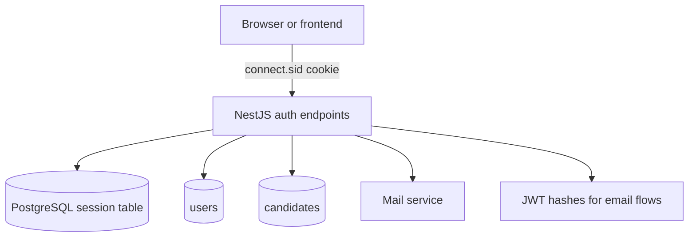
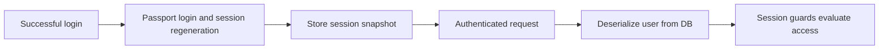
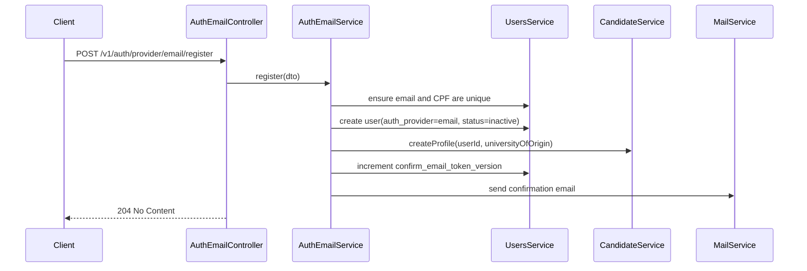
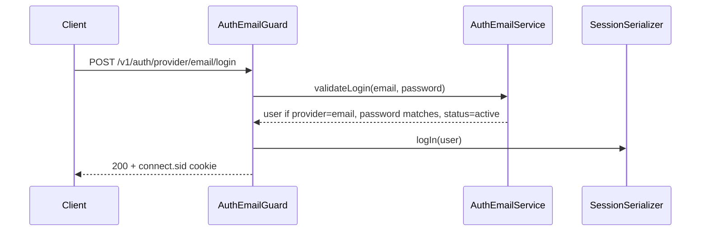
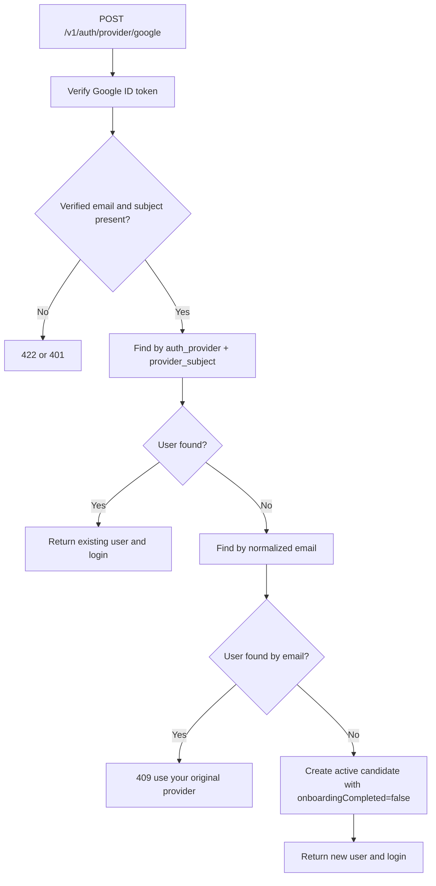

# Authentication

## Overview

Anubis uses server-side session authentication for runtime access.

- The browser authenticates with the `connect.sid` cookie.
- Sessions are stored in PostgreSQL through `connect-pg-simple`.
- The backend serializes a small user snapshot into the session and reloads the full user on each request.
- JWTs are only used for out-of-band flows: email confirmation, new-email confirmation, and password reset.
- Each user has exactly one login provider today, stored directly on `users.auth_provider` and `users.provider_subject`.
- Provider linking is not part of the current auth contract.

## Runtime Shape

Assuming the default URI versioning setup, auth routes are served under `/v1/...`.
If `APP_PREFIX` is configured, that prefix is added before the versioned path.



## Current Endpoints

### Shared session endpoints

- `GET /v1/auth/me`
- `PATCH /v1/auth/me`
- `DELETE /v1/auth/me`
- `POST /v1/auth/logout`
- `POST /v1/auth/onboarding/candidate`

### Email provider endpoints

- `POST /v1/auth/provider/email/login`
- `POST /v1/auth/provider/email/register`
- `POST /v1/auth/provider/email/confirm`
- `POST /v1/auth/provider/email/confirm/new`
- `POST /v1/auth/provider/email/forgot/password`
- `POST /v1/auth/provider/email/reset/password`

### Google provider endpoints

- `POST /v1/auth/provider/google`

### Operational endpoint

- `POST /system/change-log-level` is not part of user auth; it uses `x-system-token`.

## Data Model

### `users`

The `users` table is the auth source of truth.

- `auth_provider` identifies the login method: `email` or `google`
- `provider_subject` stores the provider-specific subject, such as the normalized email for email auth or the Google subject for Google auth
- `email`, `cpf`, `first_name`, and `last_name` store profile data
- `status`, `onboarding_completed`, and `must_change_password` drive session restrictions
- `confirm_email_token_version` and `forgot_password_token_version` invalidate old JWT hashes
- `deleted_at` is no longer part of the model; account deletion removes the row

### `candidates`

Candidate-specific onboarding data lives in `candidates` and is keyed by `user_id`.

## Auth Flow Diagrams

### Session lifecycle



### Email registration



### Email login



### Google login or signup



## How Each Flow Works

### Email registration

`POST /v1/auth/provider/email/register` creates a candidate account.

- New users are created with `authProvider=email`
- `providerSubject` is the normalized email
- The account starts as `inactive` until email confirmation succeeds
- A candidate profile is created immediately
- `onboardingCompleted` starts as `true` for this flow

### Email confirmation

`POST /v1/auth/provider/email/confirm` activates the account.

- The hash is verified with `AUTH_CONFIRM_EMAIL_SECRET`
- Token version mismatch invalidates old links
- Confirming an already active account is harmless

### Email login

`POST /v1/auth/provider/email/login` only works for users whose `authProvider` is `email`.

- The email is normalized before lookup
- Password is checked with bcrypt
- Inactive users are rejected
- Bootstrap-password expiration is enforced when `mustChangePassword` is set
- A successful login creates or refreshes the session cookie

### Google login

`POST /v1/auth/provider/google` handles both first-time signup and later login.

- The Google token must be valid and the Google email must be verified
- Existing users are matched by `authProvider=google` and `providerSubject=<google sub>`
- If the same email already belongs to an email-auth account, the request is rejected with a provider-conflict message
- First-time Google users are created as active candidates with `onboardingCompleted=false`

### Candidate onboarding completion

`POST /v1/auth/onboarding/candidate` exists mainly for restricted sessions such as first-time Google signups.

- It requires an authenticated session
- It is allowed when the only restriction is `onboardingIncomplete`
- It updates both candidate data and the user lifecycle flags

### Profile update

`PATCH /v1/auth/me` updates the current authenticated user.

- If `mustChangePassword=true`, the user can only perform a password change until that requirement is cleared
- Changing email sends a confirmation message to the new address instead of swapping immediately
- Changing password revokes other sessions for the same user
- Certain lifecycle changes can revoke all sessions

### Account deletion

`DELETE /v1/auth/me` deletes the user account and destroys the current session.

- User sessions are removed from the session store first
- The user row is then deleted from `users`
- This is a hard delete

### Logout

`POST /v1/auth/logout` destroys only the current session.

## Session Snapshot And Guards

The session serializer stores a compact snapshot with:

- `id`
- `email`
- `role`
- `status`
- `onboardingCompleted`
- `mustChangePassword`

On later requests:

1. Passport deserializes the user from the snapshot `id`
2. `SessionAuthGuard` requires an authenticated session
3. `SessionLifecycleGuard` blocks restricted sessions from unsafe routes

Restriction rules:

- `mustChangePassword=true` restricts access until the password is changed
- `onboardingCompleted=false` restricts access until onboarding is completed
- `GET /v1/auth/me` is allowed for both restricted states
- `PATCH /v1/auth/me` is allowed for `mustChangePassword`
- `POST /v1/auth/onboarding/candidate` is allowed for `onboardingIncomplete`

## Response Shapes

### Login response

Successful login responses currently return:

```ts
{
  userId: string;
  email: string | null;
  firstName: string | null;
  lastName: string | null;
  role: string;
  status: string;
  onboardingCompleted: boolean;
  mustChangePassword: boolean;
  authProvider: 'email' | 'google';
}
```

### Current user response

`GET /v1/auth/me` returns the serialized `User` entity:

```ts
{
  id: string;
  authProvider: 'email' | 'google';
  providerSubject: string | null;
  email: string | null;
  cpf: string | null;
  firstName: string | null;
  lastName: string | null;
  role: string;
  status: string;
  onboardingCompleted: boolean;
  mustChangePassword: boolean;
  bootstrapPasswordExpiresAt: string | null;
  confirmEmailTokenVersion: number;
  forgotPasswordTokenVersion: number;
  createdAt: string;
  updatedAt: string;
}
```

`password` is excluded from serialized responses.

## Error Contract

Auth endpoints return message-oriented error payloads.

- The main contract is the top-level `message` field
- `message` may be a string or an array
- Clients should not depend on field-level validation structures from auth routes
