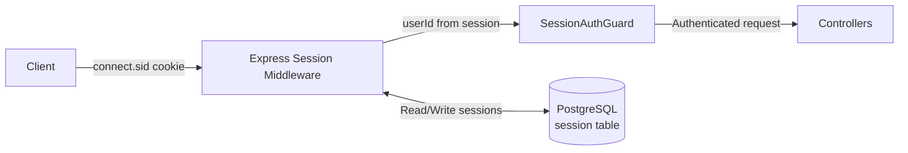
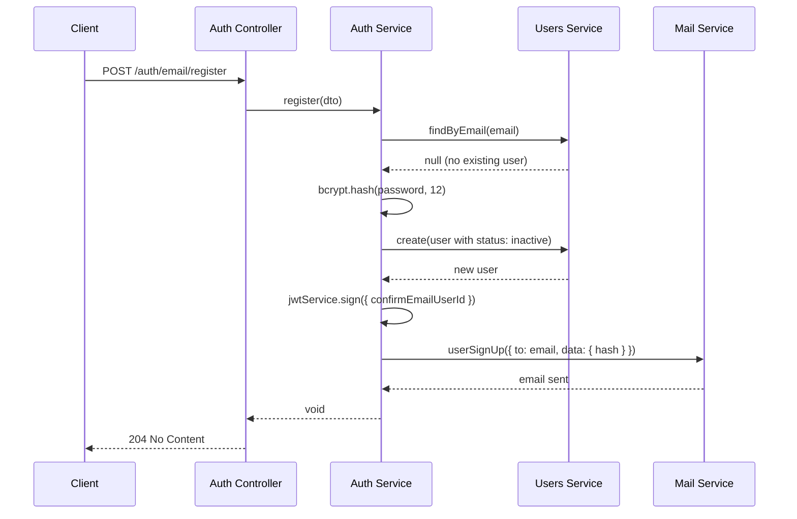
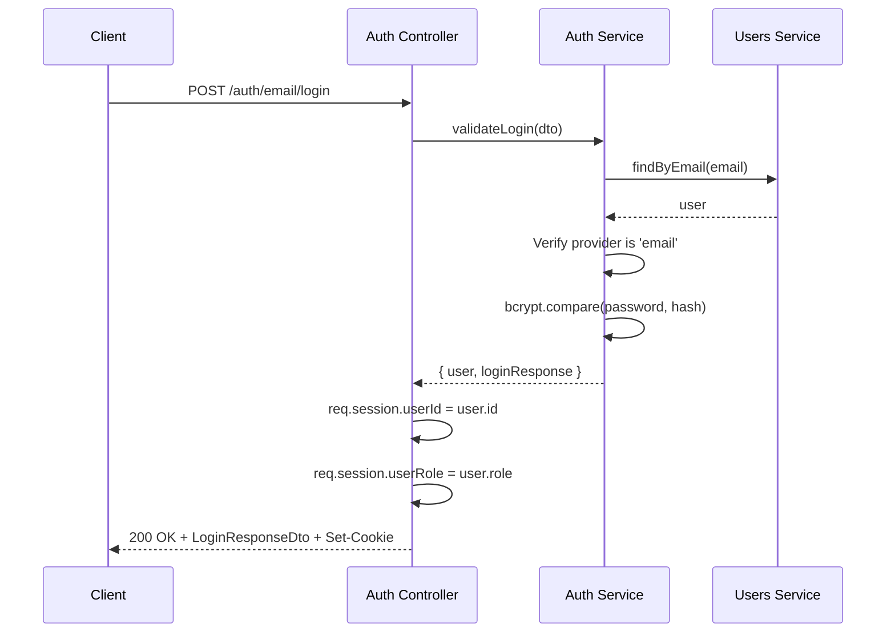
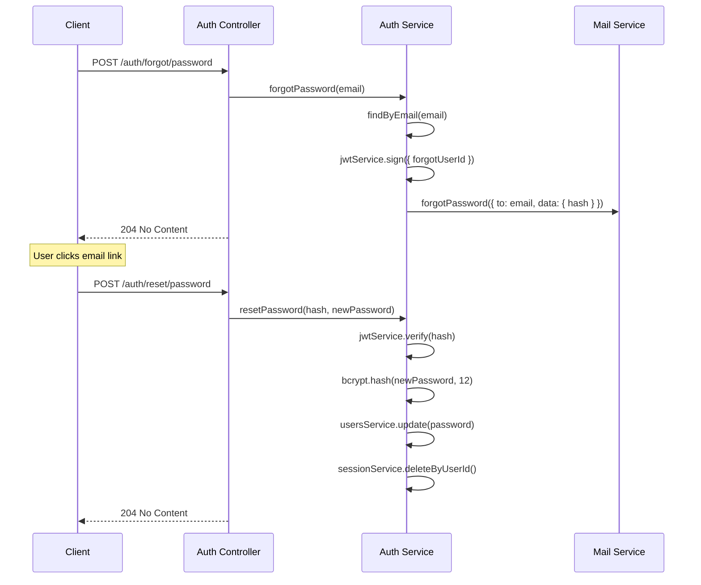
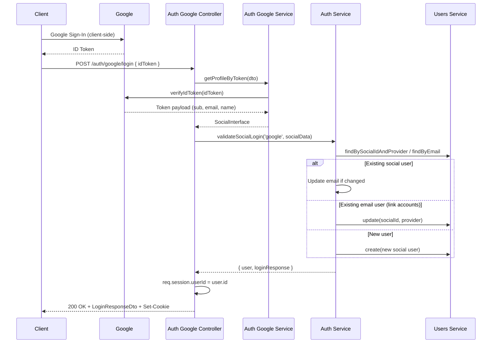

# Authentication

## Architecture Overview

Anubis uses a **hybrid authentication architecture**:

- **Session-based authentication** is the primary mechanism. Server-side sessions are stored in PostgreSQL via `express-session` + `connect-pg-simple`. A session cookie (`connect.sid`) is sent to the client and used to authenticate subsequent requests.
- **JWT tokens** are **not** used for login or session management. They are only used as short-lived, single-purpose tokens embedded in email links for email confirmation and password reset flows.



### Key Design Decisions

| Aspect           | Approach                                                             |
| ---------------- | -------------------------------------------------------------------- |
| Session storage  | PostgreSQL via `connect-pg-simple`                                   |
| Session lifetime | 7 days (cookie `maxAge`)                                             |
| Cookie flags     | `httpOnly: true`, `secure` controlled by `APP_SECURE_COOKIE` env var |
| Password hashing | bcrypt with 12 salt rounds                                           |
| JWT usage        | Email confirmation and password reset tokens only                    |
| Auth providers   | `email` (local) and `google` (OAuth)                                 |

---

## Authentication Providers

The system supports two authentication providers, defined in `src/auth/auth-providers.enum.ts`:

```typescript
export enum AuthProvidersEnum {
  email = 'email',
  google = 'google',
}
```

Each user record stores its `provider` field, which determines how the user authenticates. A user registered via email cannot log in via Google (and vice versa) unless the accounts are explicitly linked through the social login flow.

---

## Session Management

### Session Store

Sessions are stored in a PostgreSQL `session` table managed by `connect-pg-simple`. The session middleware is configured in `src/main.ts`:

- **Store**: PostgreSQL pool connection, table name `session`
- **Secret**: `APP_SESSION_SECRET` environment variable (minimum 32 characters)
- **Cookie**: `httpOnly`, 7-day `maxAge`, `secure` flag from `APP_SECURE_COOKIE`
- **Behavior**: `resave: false`, `saveUninitialized: false`

### Session Data

On successful login, two values are stored in the session:

```typescript
req.session.userId = user.id;
req.session.userRole = user.role;
```

### SessionAuthGuard

Protected routes use the `SessionAuthGuard` (`src/auth/guards/session-auth.guard.ts`), which checks for the presence of `userId` in the session:

```typescript
@Injectable()
export class SessionAuthGuard implements CanActivate {
  canActivate(context: ExecutionContext): boolean {
    const request = context.switchToHttp().getRequest<Request>();
    if (!request.session?.userId) {
      throw new UnauthorizedException();
    }
    return true;
  }
}
```

Any route decorated with `@UseGuards(SessionAuthGuard)` requires an active session.

### Session Cleanup

The `SessionService` provides methods for session invalidation:

| Method                                                    | Usage                                                                    |
| --------------------------------------------------------- | ------------------------------------------------------------------------ |
| `deleteByUserId(userId)`                                  | Invalidate all sessions for a user (used on password reset)              |
| `deleteByUserIdWithExclude({ userId, excludeSessionId })` | Invalidate all sessions except the current one (used on password change) |
| `deleteById(sid)`                                         | Delete a specific session                                                |

---

## Email/Password Authentication

### Registration Flow



1. Client sends `POST /api/v1/auth/email/register` with email, password, firstName, and lastName.
2. The service checks for an existing user with that email -- throws `422` if taken.
3. Password is hashed with bcrypt (12 salt rounds).
4. User is created with `status: inactive` and `provider: email`.
5. A JWT confirmation token is generated (signed with `AUTH_CONFIRM_EMAIL_SECRET`, expiry from `AUTH_CONFIRM_EMAIL_EXPIRES_IN`).
6. A confirmation email is sent containing the token hash.
7. Returns `204 No Content`.

### Email Confirmation

1. Client sends `POST /api/v1/auth/email/confirm` with the `hash` from the email link.
2. The JWT token is verified against `AUTH_CONFIRM_EMAIL_SECRET`.
3. The user's status is updated from `inactive` to `active`.

### Login Flow



1. Client sends `POST /api/v1/auth/email/login` with email and password.
2. The service looks up the user by email -- throws `422` if not found.
3. Verifies the user's provider is `email` (not a social login account).
4. Compares the password with bcrypt -- throws `422` if incorrect.
5. On success, the controller stores `userId` and `userRole` in the session.
6. Returns `LoginResponseDto` with user details. The session cookie (`connect.sid`) is set automatically by `express-session`.

### Login Response

```typescript
{
  userId: string;
  email: string | null;
  firstName: string | null;
  lastName: string | null;
  role: string;
  status: string;
}
```

### Forgot Password Flow



1. **Request reset**: `POST /api/v1/auth/forgot/password` with email. A JWT token is created (signed with `AUTH_FORGOT_SECRET`, expiry from `AUTH_FORGOT_EXPIRES_IN`) and emailed to the user.
2. **Reset password**: `POST /api/v1/auth/reset/password` with the hash and new password. The token is verified, the password is updated, and **all existing sessions for that user are invalidated**.

---

## Google OAuth Authentication

### Overview

Google authentication uses the `google-auth-library` to verify Google ID tokens server-side. The client is responsible for obtaining the ID token from Google's sign-in flow and sending it to the API.

### Flow



### Account Linking Logic

The `validateSocialLogin` method in `AuthService` handles three scenarios:

1. **Existing social user** (found by `socialId` + `provider`): Returns the user. If the email from Google has changed and doesn't conflict, it updates the email.
2. **Existing email user** (found by email, not by social ID): Links the Google account to the existing user by updating `socialId` and `provider`.
3. **New user** (no match by social ID or email): Creates a new user with `status: active` and `role: candidate`.

### Google Service Configuration

The `AuthGoogleService` (`src/auth-google/auth-google.service.ts`) initializes an `OAuth2Client` with:

- `GOOGLE_CLIENT_ID` -- Your Google OAuth client ID
- `GOOGLE_CLIENT_SECRET` -- Your Google OAuth client secret

The ID token is verified against the `GOOGLE_CLIENT_ID` audience.

---

## API Endpoints

All endpoints are versioned under `/api/v1/auth/`.

### Public Endpoints

| Method | Path                      | Description                    | Request Body            |
| ------ | ------------------------- | ------------------------------ | ----------------------- |
| `POST` | `/auth/email/login`       | Login with email and password  | `AuthEmailLoginDto`     |
| `POST` | `/auth/email/register`    | Register a new account         | `AuthRegisterDto`       |
| `POST` | `/auth/email/confirm`     | Confirm email address          | `AuthConfirmEmailDto`   |
| `POST` | `/auth/email/confirm/new` | Confirm new email after change | `AuthConfirmEmailDto`   |
| `POST` | `/auth/forgot/password`   | Request password reset email   | `AuthForgotPasswordDto` |
| `POST` | `/auth/reset/password`    | Reset password with token      | `AuthResetPasswordDto`  |
| `POST` | `/auth/google/login`      | Login with Google ID token     | `AuthGoogleLoginDto`    |

### Protected Endpoints (require `SessionAuthGuard`)

| Method   | Path           | Description                 | Request Body    |
| -------- | -------------- | --------------------------- | --------------- |
| `GET`    | `/auth/me`     | Get current user profile    | --              |
| `PATCH`  | `/auth/me`     | Update current user profile | `AuthUpdateDto` |
| `DELETE` | `/auth/me`     | Delete current user account | --              |
| `POST`   | `/auth/logout` | Destroy session and log out | --              |

---

## Request DTOs

### AuthEmailLoginDto

```typescript
{
  email: string; // Valid email, transformed to lowercase
  password: string; // Required
}
```

### AuthRegisterDto

```typescript
{
  email: string; // Valid email, transformed to lowercase
  password: string; // Minimum 6 characters
  firstName: string; // Required
  lastName: string; // Required
}
```

### AuthConfirmEmailDto

```typescript
{
  hash: string; // JWT token from confirmation email
}
```

### AuthForgotPasswordDto

```typescript
{
  email: string; // Valid email, transformed to lowercase
}
```

### AuthResetPasswordDto

```typescript
{
  hash: string; // JWT token from reset email
  password: string; // Minimum 6 characters
}
```

### AuthUpdateDto

```typescript
{
  firstName?: string;    // Optional, must not be empty if provided
  lastName?: string;     // Optional, must not be empty if provided
  email?: string;        // Optional, valid email, triggers confirmation flow
  password?: string;     // Optional, minimum 6 characters
  oldPassword?: string;  // Required when changing password
}
```

### AuthGoogleLoginDto

```typescript
{
  idToken: string; // Google ID token from client-side sign-in
}
```

---

## Profile Management

### Get Profile

`GET /api/v1/auth/me` returns the full user object for the authenticated session.

### Update Profile

`PATCH /api/v1/auth/me` supports partial updates:

- **Name changes**: Applied immediately.
- **Email change**: Triggers a confirmation email to the new address. The email is only updated after the user clicks the confirmation link. Throws `422` if the new email is already taken by another user.
- **Password change**: Requires `oldPassword` for verification. On success, all other sessions for the user are invalidated (the current session is preserved).

### Delete Account

`DELETE /api/v1/auth/me` performs a soft delete:

1. All sessions for the user are destroyed.
2. The user record is soft-deleted.
3. The current session is destroyed.

### Logout

`POST /api/v1/auth/logout` destroys the current session.

---

## Module Structure

```
src/
├── auth/
│   ├── auth.controller.ts          # Route handlers for email auth
│   ├── auth.module.ts              # Module: imports Users, Session, Mail, JWT
│   ├── auth.service.ts             # Core auth logic
│   ├── auth-providers.enum.ts      # Provider enum (email, google)
│   ├── dto/
│   │   ├── auth-email-login.dto.ts
│   │   ├── auth-register.dto.ts
│   │   ├── auth-confirm-email.dto.ts
│   │   ├── auth-forgot-password.dto.ts
│   │   ├── auth-reset-password.dto.ts
│   │   ├── auth-update.dto.ts
│   │   └── login-response.dto.ts
│   └── guards/
│       └── session-auth.guard.ts   # Session-based auth guard
├── auth-google/
│   ├── auth-google.controller.ts   # Route handler for Google OAuth
│   ├── auth-google.module.ts       # Module: imports AuthModule
│   ├── auth-google.service.ts      # Google token verification
│   └── dto/
│       └── auth-google-login.dto.ts
├── session/                        # Session persistence (Drizzle + PostgreSQL)
├── users/                          # User domain and persistence
└── mail/                           # Email sending (Nodemailer)
```

---

## Environment Variables

All auth-related environment variables and their purposes:

| Variable                        | Required    | Default | Description                                                              |
| ------------------------------- | ----------- | ------- | ------------------------------------------------------------------------ |
| `APP_SESSION_SECRET`            | Yes         | --      | Secret for signing session cookies. Minimum 32 characters.               |
| `APP_SECURE_COOKIE`             | No          | `false` | Set to `true` in production to require HTTPS for cookies.                |
| `GOOGLE_CLIENT_ID`              | Yes         | --      | Google OAuth 2.0 client ID.                                              |
| `GOOGLE_CLIENT_SECRET`          | Yes         | --      | Google OAuth 2.0 client secret.                                          |
| `AUTH_CONFIRM_EMAIL_SECRET`     | Yes         | --      | JWT signing secret for email confirmation tokens. Minimum 32 characters. |
| `AUTH_CONFIRM_EMAIL_EXPIRES_IN` | No          | `1d`    | Expiry duration for email confirmation tokens.                           |
| `AUTH_FORGOT_SECRET`            | Yes         | --      | JWT signing secret for password reset tokens. Minimum 32 characters.     |
| `AUTH_FORGOT_EXPIRES_IN`        | No          | `30m`   | Expiry duration for password reset tokens.                               |
| `FRONTEND_URL`                  | Yes         | --      | Frontend URL used to construct links in emails.                          |
| `MAIL_TRANSPORT`                | Yes         | --      | Mail transport type: `smtp` or `google-oauth`.                           |
| `MAIL_HOST`                     | Conditional | --      | SMTP host (required when `MAIL_TRANSPORT=smtp`).                         |
| `MAIL_PORT`                     | Conditional | --      | SMTP port (required when `MAIL_TRANSPORT=smtp`).                         |
| `MAIL_DEFAULT_FROM`             | Yes         | --      | Default sender address for outgoing emails.                              |

!!! tip "Development Setup"
Copy `.env.example` to `.env` and fill in the values. For local development, the defaults use Mailpit on `localhost:1025` for email and do not require HTTPS cookies.

---

## Security Considerations

- **Passwords** are hashed with bcrypt using 12 salt rounds before storage. Plain-text passwords are never persisted.
- **Session cookies** are `httpOnly` (not accessible to JavaScript) and can be configured as `secure` (HTTPS-only) via `APP_SECURE_COOKIE`.
- **JWT tokens** used in email links are short-lived and signed with dedicated secrets separate from the session secret.
- **Password reset** invalidates all existing sessions for the user, forcing re-authentication on all devices.
- **Password change** invalidates all other sessions except the current one.
- **Account deletion** is a soft delete -- the user record is marked as deleted and all sessions are destroyed.
- **Email changes** require confirmation via a link sent to the new address, preventing unauthorized email takeover.
- **Input validation** is enforced on all DTOs using `class-validator` decorators (email format, minimum password length, required fields).
